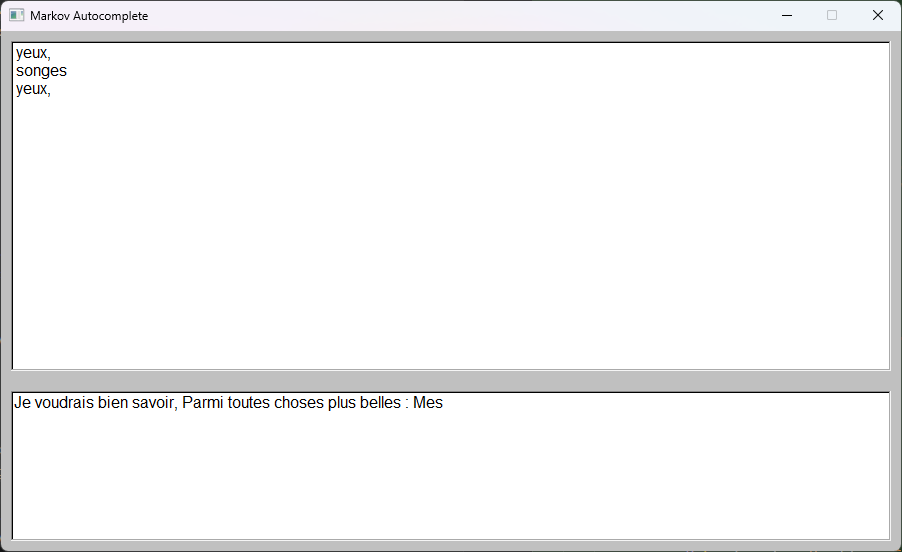

# Markov Chain Auto-complete

**Author:** Antoine Koltou



## Presentation 

This project is a re-creation of a next-word predictor you can typically see on your phone when you type text.

Andreï Markov was a pretty smart guy. I would personally consider him one of the fathers of modern Bayesian statistics, even though he never claimed to be one in his life.

To make it short, most of the probability that people used to do back at the beginning of the 20th century was frequentist statistics. Some even claimed that since we could observe the law of large numbers, this was surely proof of free will and of God's existence (Hi Nekrasov).

But Markov managed to prove that those arguments were completely false. You could observe the law of large numbers without event independence. We'll see exactly what it means down below.

---

## I - Probability/Statistics Without Markov Chains

There is a common probability/statistical law which says: if you repeat an experiment enough times, the number of occurrences will almost perfectly match the probability distribution of the events.

I will demonstrate it myself by making several coin tosses.

If I toss 10 coins on my end, I will get the following result: 6 Heads, 4 Tails.

$$
P(\text{Heads}) = 0.6, \quad P(\text{Tails}) = 0.4
$$

Which is not bad, but we can do better.

For 100 coins, I will get the following result: 54 Heads and 46 Tails.

$$
P(\text{Heads}) = 0.54, \quad P(\text{Tails}) = 0.46
$$

Which is an improvement.

For 1000 coins, I will get the following result: 508 Heads and 492 Tails.

$$
P(\text{Heads}) = 0.508, \quad P(\text{Tails}) = 0.492
$$

Which almost perfectly matches our true probability distribution.

Here's an another example of the large number with dices, the more we play the more we get closer to the mean defined by the distribution.


So that's the main idea behind the law of large numbers: the more you experiment, the closer you will get to the true distribution. That's why casinos always win in the end, even with so-called smart strategies like "Fibonacci" or "Doubling bet".

But one common misconception about the law of large numbers is that if you can see the law of large numbers, then it means that events are independent from each other.

> An event is said to be independent from another if experiencing an event $A$ has no influence on the probability of event $B$.

For example, a coin toss is independent. If you get Tails 5 times, your chance of getting Tails is still $0.5$, and Heads is still $0.5$. If you don't think so, you fall into the gambler's fallacy.

But a non-independent event would typically be, for example, drawing a ball from an urn without replacement. If you have an urn with 5 red balls and 5 blue balls, then:

$$
P(\text{Red}) = 0.5, \quad P(\text{Blue}) = 0.5
$$

If you draw a blue ball, for example, this event directly changes the probabilities of the next ball, which become:

$$
P(\text{Red}) = 0.666666\ldots, \quad P(\text{Blue}) = 0.44444\ldots
$$

The event you experienced has a direct influence on the next event.

But believe it or not, even in non-independent events, the law of large numbers will still appear. Let's take a French poem, for example. I took *L'Horloge* by Charles Baudelaire, but you can take anything else and you will still observe the same findings.

In this poem, there is a $54.39\$% probability of observing a vowel and a $45.61\$% chance of observing a consonant.

And if you try to observe the law of large numbers in other French texts, you will find very close probabilities.

But even though we can experience the law of large numbers here, it doesn't imply at all that observing a vowel or observing a consonant is independent!

Let's observe all the frequencies when we take in account the previous character:

$$
P(V \mid C) = 0.6120
$$

$$
P(C \mid C) = 0.3880
$$

$$
P(V \mid V) = 0.2716
$$

$$
P(C \mid V) = 0.7284
$$

As you can see, it is really different from our original probability. The previous character really has an influence because it changes the simple frequency probability a lot.

Let's formalize this into a useful mathematical object.

---

## II - What's a Markov Chain?

Now that we clearly understand the difference between Bayesian and frequentist statistics/probability, let's talk about **Markov Chains**.

A random process, or stochastic process, is a sequence defined with random variables. I won't fully detail how they work because I don't have enough virtual ink. But keep the idea of a sequence defined with random variables, and you should be good to go.

The **Markov random process** satisfies one important property:

```math
P(X_{n+1} = j \mid X_n = i,\; X_{n-1},\; \dots,\; X_0)
=
P(X_{n+1} = j \mid X_n = i)
```

No matter how many random events occurred, the only event that is important to predict the next event is either no event or the previous one.

For example, an iid process (**independent and identically distributed**) is a valid Markov random process. A random process defined through the probabilities of vowels/consonants we observed previously is also a valid Markov process. But a random process where the two previous events have an impact on the next prediction is not a valid Markov random process.

The main cool thing about Markov chains is that we only need to know 2 things:

1. What do we want to predict?
2. What was the previous event?

Since we only need two pieces of information, this implies that we can sort those pieces of information in a matrix! Which means we can benefit from all the existing theorems around linear algebra. For example, let's define a Markov chain with four weather states:

$$
\text{Sunny}, \quad \text{Cloudy}, \quad \text{Rainy}, \quad \text{Snow}
$$

We can represent the transition probabilities with the following stochastic matrix:

$$
T =
\begin{bmatrix}
P(\text{Sunny} \mid \text{Sunny}) & P(\text{Sunny} \mid \text{Cloudy}) & P(\text{Sunny} \mid \text{Rainy}) & P(\text{Sunny} \mid \text{Snow}) \\
P(\text{Cloudy} \mid \text{Sunny}) & P(\text{Cloudy} \mid \text{Cloudy}) & P(\text{Cloudy} \mid \text{Rainy}) & P(\text{Cloudy} \mid \text{Snow}) \\
P(\text{Rainy} \mid \text{Sunny}) & P(\text{Rainy} \mid \text{Cloudy}) & P(\text{Rainy} \mid \text{Rainy}) & P(\text{Rainy} \mid \text{Snow}) \\
P(\text{Snow} \mid \text{Sunny}) & P(\text{Snow} \mid \text{Cloudy}) & P(\text{Snow} \mid \text{Rainy}) & P(\text{Snow} \mid \text{Snow})
\end{bmatrix}
$$

Here, the columns are the **priors**, and the rows are the **predictions**.
Here's how to read the stochastic matrix: you select your prior through the column, and you choose your prediction through the row. Therefore:

$$
P(\text{Sunny} \mid \text{Rainy}) = T_{1,3}
$$

We can also represent a markov chain via a graph, and also benefit from different theorems definied in graph theory. Here's the same matrix defined with arbitrary probabilities.


Cool facts about Markov chains:

* How do we calculate the probability of going from Rainy to Sunny after 5 days? It's really simple: just calculate $T^5$, and retrieve:

$$
(T^5)_{1,3}
$$

* If I play infinitely, where will I arrive? Quite simple: you will need a state vector $\mu_0$, which tells you where you start, and then calculate:

$$
\lim_{n \to \infty} \mu_0 T^n
$$

It's actually really easy to play with and control Markov chains. There are plenty of other theorems that exist around them. Some of them are implemented in my code, but I won't go through all of them. Feel free to explore my sources or the source code.

---

## III - Implementing the Auto-complete

So now that we fully grasp the power of Markov chains, let's use them. First, let's ask which object we will store. 
We will store one-grams and bi-grams, to make it clear:

* A one-gram uses the previous word to predict the next word.
* A bi-gram uses the two previous words to predict the next word.

For example:

$$
P(\text{"are"} \mid \text{"How"}) = \dots
$$

$$
P(\text{"you"} \mid (\text{"How"}, \text{"are"})) = \dots
$$

To store them, we can't really store them in a matrix because the matrix would be pretty huge, and we would store a bunch of zero probabilities. So, for optimization purposes, we will store them in a hash map containing the n-gram and another hash map mapping words to their frequencies.

Typical hash map:
```txt
"how"     -> ["are" -> 5, "to" -> 3]
"how are" -> ["you" -> 8]
```
With frequencies, it is quite easy to build a probability distribution. We won't detail it, but C++ has some pretty sweet standard libraries to do so.

To build such a hash map, you need to provide a corpus in:

`data/corpus.txt`

My code will extract every frequency, and once they are all extracted, the auto-complete can now work. I provided all the poems of Charles Baudelaire to build a Baudelaire auto-complete. But I also tried it with all my Discord messages, which I won't provide for obvious reasons lol, and the auto-complete really has a similar lexical style to mine.

---

## IV - Limitations

Once you play enough with the Markov chain auto-complete, you will quickly notice that even though the results seem "correct", they will soon produce nonsense. And it's quite normal: the model only has a context of the two last words.
So how do we fix this?

* **Making bigger n-grams:** for now, the biggest n-grams I use are bi-grams, so I only use the two last words. But we can completely use higher n-grams. However, the higher you increase $n$, the more you will obtain unique entries, and we will fall into the curse of dimensionality.

* **Tokenization:** it could be interesting for other types of models, but tokenization won't be user-friendly for the person using the model.

* **Using another type of model:** well, typically, that would be the best choice. Markov models are really "stochastic parrots". They only repeat what they once saw, and they have no understanding of lexical laws. One type of model which is pretty popular, and which you **probably** heard of, is LLMs. I might implement one from scratch another day. But those models are way better at those tasks because they have a concrete lexical understanding.


By the way, i want to share one of my realisation, this is probably one of the easiest implementation i've ever made in all the models i've already implemented, but yet it's one of the most powerful.

---

## Additional Note 

The mathematical foundations for this explanation were primarily based on these excellent resources:

* The document: [Veritasium - The Strange Math That Predicts (Almost) Anything](https://youtu.be/KZeIEiBrT_w)
* The book: *Probability and Statistics for Data Science* - Carlos Fernandez-Granda
* The video series: *Normalized Nerds - Markov Chain Explained*

The code and initial mathematical calculations were **completely written by me**. Due to my struggles with grammar, I relied on AI for corrections and for converting the text into a clean LaTeX-friendly format. 
I also wrote the GUI by AI, not the algorithms. I was simply not intersted in writting the GUI.
